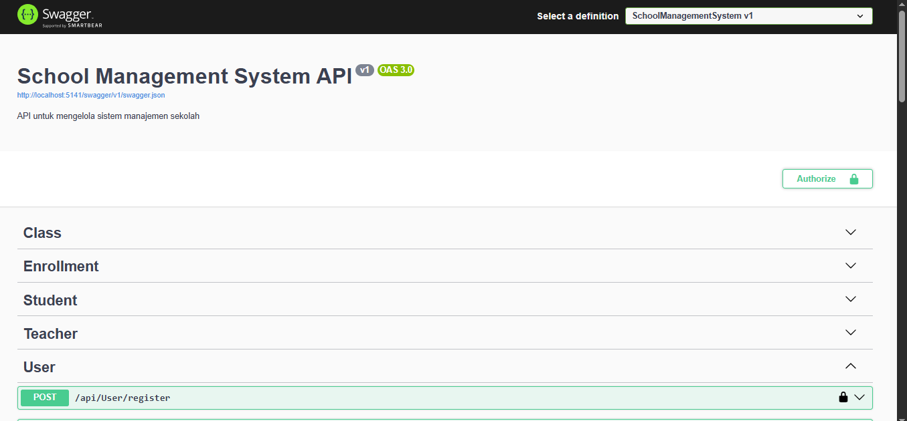
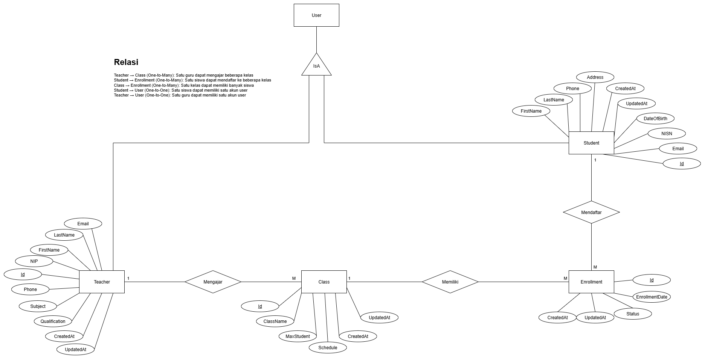
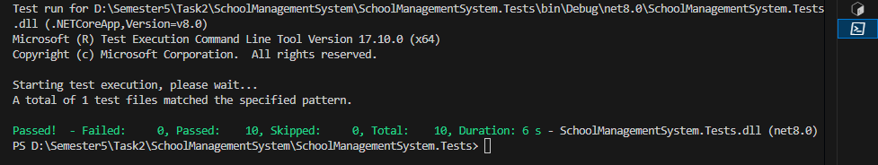

# School Management System - Backend

Selamat datang di proyek **School Management System**!  
Ini adalah REST API backend yang dibangun dengan **.NET 8** dan **PostgreSQL** menggunakan **Supabase** sebagai penyedia database. Sistem ini dirancang untuk mengelola data siswa, guru, kelas, dan pendaftaran dengan kode yang terstruktur, modular, dan mengikuti praktik terbaik. Proyek ini dilengkapi dengan dokumentasi API interaktif via **Swagger** dan menggunakan file `.env` untuk konfigurasi lingkungan.

---
## 🌐 Demo Online

Aplikasi telah dideploy dan dapat diakses melalui:
**https://schoolmanagementsystem-production-d53f.up.railway.app/swagger**

### Akun Demo untuk Testing:
- **Admin**
  - Username: `admin`
  - Password: `string`
  
- **Student**
  - Username: `annisa.dian`
  - Password: `Student123!`
  
- **Teacher**
  - Username: `hendra.wijaya`
  - Password: `Teacher123!`

---

## 📚 Fitur Utama

1. **Siswa (Students)**
   - Tambah, lihat, perbarui, dan hapus data siswa.
   - Otomatis membuat akun pengguna dengan peran "Student" saat siswa baru ditambahkan.

2. **Guru (Teachers)**
   - Tambah, lihat, perbarui, dan hapus data guru.
   - Otomatis membuat akun pengguna dengan peran "Teacher" saat guru baru ditambahkan.

3. **Kelas (Classes)**
   - Buat kelas baru dan tetapkan/hapus guru.
   - Lihat daftar kelas beserta informasi guru dan jumlah siswa.

4. **Pendaftaran (Enrollments)**
   - Daftarkan siswa ke kelas dengan validasi kapasitas dan pendaftaran ganda.
   - Lihat semua pendaftaran dengan detail siswa dan kelas.
   - Kelola status pendaftaran: **Active**, **Inactive**, **Completed**.

5. **Autentikasi & Otorisasi**
   - Manajemen peran pengguna berbasis JWT: **Admin**, **Teacher**, **Student**.
   - Admin memiliki akses penuh, Teacher hanya ke kelas yang diajar, dan Student hanya ke data pendaftarannya.
     
6. **Pagination**
   - Semua endpoint `GET` untuk daftar data (students, teachers, classes, enrollments) dilengkapi dengan sistem pagination untuk performa optimal.
---

## 🖼️ Tampilan Dokumentasi
   

---

## 🛠️ Prasyarat

- [.NET 8 SDK](https://dotnet.microsoft.com/en-us/download/dotnet/8.0)
- [Supabase Account](https://supabase.com/) untuk PostgreSQL
- [Postman](https://www.postman.com/) untuk pengujian API
- [Git](https://git-scm.com/)

---

## 🚀 Cara Menjalankan Proyek Secara Lokal

1. **Kloning Repositori**
   ```bash
   git clone https://github.com/AnnisaDianFadillah06/SchoolManagementSystem.git
   cd SchoolManagementSystem
   ```

2. **Konfigurasi Environment**
   - Salin file `.env.example` menjadi `.env`:
     ```bash
     cp .env.example .env
     ```
   - Isi file `.env` dengan kredensial Supabase dan konfigurasi lainnya.
   - Contoh Konfigurasi .env
   ```env
    ConnectionStrings__DefaultConnection=Host=db.xxxxxx.supabase.co;Port=5432;Database=postgres;Username=postgres;Password=your-password
    Jwt__Key=your-very-secure-secret-key-32-chars
    Jwt__Issuer=SchoolManagementSystem
    Jwt__Audience=SchoolManagementSystem
    ASPNETCORE_ENVIRONMENT=Development
    ASPNETCORE_URLS=http://localhost:5141
   ```
   - Pastikan file `appsettings.json` ada di root direktori dengan konfigurasi yang sesuai.
   - Contoh Konfigurasi .appsettings.json
   ```appsettings.json
    {
      "ConnectionStrings": {
        "DefaultConnection": "Host=db.xxxxxx.supabase.co;Port=5432;Database=postgres;Username=postgres;Password=your-password;SSL Mode=Require;Trust Server Certificate=true"
      },
      "JwtSettings": {
        "Secret": "your-very-secure-secret-key-32-chars",
        "Issuer": "SchoolManagementSystem",
        "Audience": "SchoolManagementSystem",
        "ExpiryMinutes": 3600
      },
      "Logging": {
        "LogLevel": {
          "Default": "Information",
          "Microsoft.AspNetCore": "Warning"
        }
      },
      "AllowedHosts": "*"
    }
   ```


3. **Instalasi Dependensi**
   ```bash
   dotnet restore
   ```

4. **Migrasi Database**
   - Pastikan proyek Supabase sudah dibuat.
   - Jalankan migrasi:
     ```bash
     dotnet ef database update
     ```

5. **Menjalankan Aplikasi**
   ```bash
   dotnet run
   ```
   Aplikasi akan berjalan di [http://localhost:5141](http://localhost:8080).  
   **Swagger UI**: Buka [http://localhost:8080/swagger](http://localhost:8080/swagger) untuk dokumentasi API.

---

## 🗄️ Pengaturan Database (Supabase)

1. **Buat Proyek di Supabase**
   - Daftar/masuk ke [Supabase Dashboard](https://app.supabase.com/).
   - Buat proyek baru dan simpan kredensial database (host, port, username, password).

2. **Struktur Database**
   - Tabel: **Students**, **Teachers**, **Classes**, **Enrollments**, **Users**.
   - Hubungan antar tabel dijelaskan pada ERD:
     

3. **Migrasi**
   - Tabel akan dibuat otomatis saat menjalankan `dotnet ef database update`.

---

## 📒 Dokumentasi API (Swagger)

Dokumentasi lengkap tersedia di `/swagger`. Berikut ringkasan endpoint utama:

### 1. Siswa (Students)
| Metode | Endpoint             | Deskripsi            | Contoh Body (POST/PUT)                                                                 |
|--------|----------------------|----------------------|---------------------------------------------------------------------------------------|
| POST   | `/api/students`      | Tambah siswa         | `{"nisn": "1234567890", "firstName": "Alice", "lastName": "Johnson", "email": "alice.johnson@example.com", "phone": "+6281234567890", "dateOfBirth": "2005-05-10T00:00:00.000Z", "address": "123 Jalan Merdeka, Jakarta"}` |
| GET    | `/api/students`      | Lihat semua siswa    | -                                                                                     |
| PUT    | `/api/students/{id}` | Perbarui data siswa  | `{"nisn": "1234567890", "firstName": "Alice", "lastName": "Johnson", "email": "alice.updated@example.com", "phone": "+6281234567890", "dateOfBirth": "2005-05-10T00:00:00.000Z", "address": "456 Jalan Sudirman, Jakarta"}` |
| DELETE | `/api/students/{id}` | Hapus siswa          | -                                                                                     |


### 2. Guru (Teachers)
| Metode | Endpoint             | Deskripsi            | Contoh Body (POST/PUT)                                                                 |
|--------|----------------------|----------------------|---------------------------------------------------------------------------------------|
| POST   | `/api/teachers`      | Tambah guru          | `{"nip": "0987654321", "firstName": "Jane", "lastName": "Doe", "email": "jane.doe@example.com", "phone": "+6289876543210", "subject": "Mathematics", "qualification": "Master of Science in Mathematics"}` |
| GET    | `/api/teachers`      | Lihat semua guru     | -                                                                                     |
| PUT    | `/api/teachers/{id}` | Perbarui data guru   | `{"nip": "0987654321", "firstName": "Jane", "lastName": "Doe", "email": "jane.updated@example.com", "phone": "+6289876543210", "subject": "Mathematics", "qualification": "PhD in Mathematics"}` |
| DELETE | `/api/teachers/{id}` | Hapus guru           | -                                                                                     |


### 3. Kelas (Classes)
| Metode | Endpoint             | Deskripsi            | Contoh Body (POST/PUT)                                        |
|--------|----------------------|----------------------|---------------------------------------------------------------|
| POST   | `/api/classes`       | Buat kelas           | `{"className": "Mathematics 101", "subject": "Mathematics", "teacherId": 1, "maxStudents": 30, "schedule": "Monday, Wednesday 08:00-10:00"}` |
| GET    | `/api/classes`       | Lihat semua kelas    | -                                                             |
| PUT    | `/api/classes/{id}`  | Perbarui kelas       | `{"className": "Mathematics 101", "subject": "Mathematics", "teacherId": 2, "maxStudents": 30, "schedule": "Tuesday, Thursday 09:00-11:00"}` |
| DELETE | `/api/classes/{id}`  | Hapus kelas          | -                                                             |


### 4. Pendaftaran (Enrollments)
| Metode | Endpoint               | Deskripsi            | Contoh Body (POST)                       |
|--------|------------------------|----------------------|------------------------------------------|
| POST   | `/api/enrollments`     | Daftarkan siswa      | `{"studentId": 1, "classId": 1}`         |
| GET    | `/api/enrollments`     | Lihat semua pendaftaran | -                                     |
| PUT    | `/api/enrollments/{id}`| Perbarui status      | `{"status": "Inactive"}`                 |
| DELETE | `/api/enrollments/{id}`| Hapus pendaftaran    | -                                        |


### 5. Autentikasi
| Metode | Endpoint          | Deskripsi            | Contoh Body                                  |
|--------|-------------------|----------------------|----------------------------------------------|
| POST   | `/api/auth/login` | Login untuk JWT      | `{"username": "alice.johnson", "password": "Student123!"}` |


---

## 📚 Penjelasan Status Enrollment

Status pendaftaran yang valid:
- **Active**: Siswa aktif di kelas, dihitung dalam kapasitas kelas.
- **Inactive**: Siswa tidak aktif sementara, dapat diaktifkan kembali.
- **Completed**: Siswa telah menyelesaikan kelas, tidak dapat kembali aktif.

Ubah status via `PUT /api/enrollments/{id}` dengan body seperti:
```json
{"status": "Inactive"}
```

---

## 🧑‍💻 Fitur Auto-Create User

- **Student**:
  - **Username**: Bagian sebelum `@` dari email (misal: `alice.johnson` dari `alice.johnson@example.com`).
  - **Role**: "Student".
  - **Password Default**: `Student123!`.
- **Teacher**:
  - **Username**: Bagian sebelum `@` dari email.
  - **Role**: "Teacher".
  - **Password Default**: `Teacher123!`.
- **Validasi**:
  - Email harus unik.
  - Jika username sudah ada, counter ditambahkan (misal: `alice.johnson1`).

---

## 🧪 Cara Menjalankan Unit Test

1. Masuk ke folder test:
   ```bash
   cd SchoolManagementSystem.Tests
   ```
2. Jalankan test:
   ```bash
   dotnet test
   ```
3. Hasil test akan ditampilkan di terminal.  
   Contoh hasil sukses:
   

---

## 📂 Struktur Folder

```
SchoolManagementSystem/
├── Common/                 # Komponen bersama di seluruh modul
│   ├── Attributes/         # Atribut kustom untuk otorisasi
│   ├── Constants/          # Nilai statis seperti string, enum, dan kunci konfigurasi
│   ├── Helpers/            # Kelas bantu statis (misal: tanggal, string, JWT helpers)
│   ├── Requests/           # Model permintaan bersama
│   ├── Responses/          # Model respons bersama atau wrapper (misal: ApiResponse<T>)
│   └── Utilities/          # Kelas utilitas (misal: paginasi, hashing)
├── docs/                   # Dokumentasi
│   └── images/             # Gambar untuk dokumentasi
├── Modules/                # Modul berorientasi fitur (pemisahan gaya DDD)
│   ├── Students/           # Modul untuk manajemen siswa
│   │   ├── StudentController.cs  # Kontroller API untuk siswa
│   │   ├── Dtos/           # Data Transfer Objects (DTO) untuk siswa
│   │   ├── Entities/       # Entitas domain untuk siswa
│   │   ├── Mappers/        # Pemetaan antara DTO dan entitas
│   │   ├── Repositories/   # Lapisan repositori untuk siswa
│   │   └── Services/       # Logika bisnis untuk siswa
│   ├── Teachers/           # Modul untuk manajemen guru
│   │   ├── TeacherController.cs  # Kontroller API untuk guru
│   │   ├── Dtos/           # DTO untuk guru
│   │   ├── Entities/       # Entitas domain untuk guru
│   │   ├── Mappers/        # Pemetaan untuk guru
│   │   ├── Repositories/   # Lapisan repositori untuk guru
│   │   └── Services/       # Logika bisnis untuk guru
│   ├── Classes/            # Modul untuk manajemen kelas
│   │   ├── ClassController.cs    # Kontroller API untuk kelas
│   │   ├── Dtos/           # DTO untuk kelas
│   │   ├── Entities/       # Entitas domain untuk kelas
│   │   ├── Mappers/        # Pemetaan untuk kelas
│   │   ├── Repositories/   # Lapisan repositori untuk kelas
│   │   └── Services/       # Logika bisnis untuk kelas
│   ├── Enrollments/        # Modul untuk manajemen pendaftaran
│   │   ├── EnrollmentController.cs # Kontroller API untuk pendaftaran
│   │   ├── Dtos/           # DTO untuk pendaftaran
│   │   ├── Entities/       # Entitas domain untuk pendaftaran
│   │   ├── Mappers/        # Pemetaan untuk pendaftaran
│   │   ├── Repositories/   # Lapisan repositori untuk pendaftaran
│   │   └── Services/       # Logika bisnis untuk pendaftaran
│   └── Users/              # Modul untuk autentikasi dan peran
│       ├── UserController.cs      # Kontroller API untuk pengguna
│       ├── Dtos/           # DTO untuk pengguna
│       ├── Entities/       # Entitas domain untuk pengguna
│       ├── Mappers/        # Pemetaan untuk pengguna
│       ├── Repositories/   # Lapisan repositori untuk pengguna
│       └── Services/       # Logika bisnis untuk pengguna
├── Middlewares/            # Middleware global (misal: penanganan eksepsi, logging)
│   └── JwtMiddleware.cs        # Middleware untuk autentikasi JWT
├── Migrations/             # File migrasi database (dibuat oleh Entity Framework)
├── Configurations/         # Konfigurasi aplikasi dan ekstensi
│   ├── ApplicationDbContext.cs # Konteks Entity Framework untuk database
│   ├── DatabaseConfig.cs      # Konfigurasi layanan database (Npgsql)
│   └── ServiceExtensions.cs    # Ekstensi layanan (AutoMapper, repositories, JWT)
├── Program.cs              # Titik masuk aplikasi (.NET 8 - hosting minimal)
├── appsettings.json        # File konfigurasi aplikasi
├── .env                    # Variabel lingkungan (misal: koneksi DB)
└── README.md               # Dokumentasi setup dan API
```

---

## 📄 Lisensi

Proyek ini dibuat untuk keperluan pembelajaran Kerja Praktik.

---

## 📞 Kontak

Annisa Dian Fadillah  
[GitHub](https://github.com/AnnisaDianFadillah06)  
[Email](mailto:annisadianfadillah@gmail.com)
